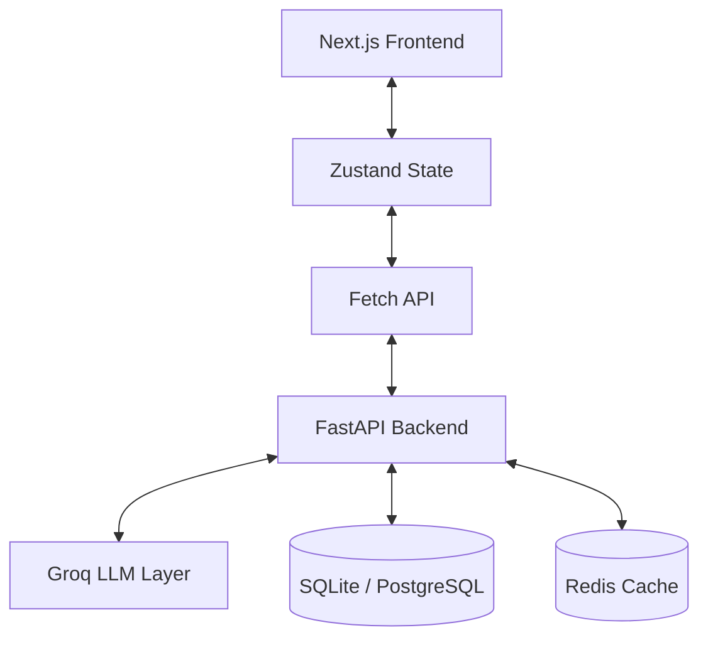

# HabitFlow OS — AI Cognitive Productivity System 🐸🧠

HabitFlow OS is an AI-powered cognitive productivity system designed to help users reduce cognitive overload, regain focus, and move through tasks with less friction and overwhelm.

Instead of functioning as a traditional task manager, HabitFlow combines intelligent prioritization, emotionally-aware AI guidance, focus recovery systems, and immersive execution flows into one connected productivity experience.

The platform is inspired by:
- Cognitive Behavioral Therapy (CBT) grounding principles
- ADHD-friendly productivity workflows
- Deep focus environments
- Emotion-aware UX design
- Calm, low-pressure interaction systems

---

# ✨ Core Features

## 🐸 Eat The Frog Priority Engine
An intelligent prioritization system that dynamically recommends the most impactful tasks from the Eisenhower Matrix.

### Features
- Q1/Q2 intelligent task filtering
- Cognitive-context-aware recommendations
- AI-generated reasoning for task selection
- Stress-reduction focused prioritization
- Dynamic task rotation after completion

---

## 🧘 Tiny Mode — Immersive Focus System
A distraction-free execution environment designed to reduce overwhelm and help users regain momentum safely.

### Features
- Minimal calming UI
- Breathing / grounding guidance
- Gentle encouragement flow
- Single-task execution mode
- Smooth completion transitions
- Automatic next-step suggestions

---

## 🧠 Brain Dump AI
A cognitive offloading system that helps users untangle chaotic thoughts into actionable next steps.

### Features
- AI-powered task extraction
- Emotional reframing
- Context persistence
- Inbox integration
- Historical dump tracking
- Archive & pin support

---

## 📅 Time Blocking Integration
Tasks seamlessly flow into a visual scheduling system.

### Features
- Automatic focus slot creation
- Calendar synchronization
- Matrix → Frog → Time Block workflow
- Task-linked calendar blocks
- Completed block visual states

---

## 🚨 Focus Rescue System
A contextual AI recovery flow for moments of overwhelm.

### Features
- Stress-aware intervention
- Dynamic next-step suggestions
- Tiny Mode launch integration
- Context-aware calming prompts

---

## ↩️ Undo-First UX
A reversible interaction system designed to reduce anxiety around mistakes.

### Features
- Undo task completion
- Undo deletions
- Undo archive actions
- Reversible state transitions

---

# 🧠 AI & Cognitive Layer

HabitFlow OS uses a hybrid AI architecture.

## Local AI Layer
Used for:
- task extraction
- semantic parsing
- lightweight reasoning
- contextual organization

### Models
- `flan-t5-small`
- `all-MiniLM-L6-v2`

---

## Cloud AI Layer
Used for:
- emotional intelligence
- contextual reflections
- cognitive support
- adaptive focus guidance
- Arabic understanding

### Provider
- Groq API

### Models
- `llama-3.3-70b-versatile`
- `llama-3.1-8b-instant`

---

# 🏗️ Architecture



---

# 🛠️ Tech Stack

## Frontend
- Next.js 14
- React
- TypeScript
- Zustand
- Tailwind CSS
- Framer Motion
- Recharts
- Lucide React

---

## Backend
- FastAPI
- Python
- SQLAlchemy
- SQLite / PostgreSQL
- Redis

---

## AI
- Groq API
- HuggingFace Transformers
- FLAN-T5
- Sentence Transformers

---

## DevOps
- Docker
- Docker Compose

---

# 📸 Screenshots

## Dashboard


---

## Tiny Mode


---

## Brain Dump AI


---

## Eisenhower Matrix


---

## Time Blocking


---
## Second Brain


## Habits


## Pomodoro Timer


# 🚀 Getting Started

## Prerequisites
- Node.js v18+
- Python 3.10+
- Docker (optional)

---

# 🐳 Run with Docker

```bash
docker compose up --build
```

Frontend:
```txt
http://localhost:3000
```

Backend:
```txt
http://localhost:8001/docs
```

---

# 💻 Local Development

## Backend

```bash
cd backend
python -m venv venv
```

### Windows
```bash
venv\Scripts\activate
```

### Install dependencies
```bash
pip install -r requirements.txt
```

### Run backend
```bash
uvicorn main:app --reload --port 8001
```

---

## Frontend

```bash
cd frontend
npm install
```

Create:
```env
.env.local
```

Add:
```env
NEXT_PUBLIC_API_URL=http://localhost:8001
```

### Run frontend
```bash
npm run dev
```

Open:
```txt
http://localhost:3000
```

---

# 🎯 Demo Flow

## 1. Brain Dump
Write overwhelming thoughts into Brain Dump AI and let the system organize them into actionable tasks.

---

## 2. Matrix Prioritization
Move tasks through the Eisenhower Matrix and let the AI identify high-impact priorities.

---

## 3. Eat The Frog
Select a recommended focus task and review the AI-generated reasoning behind the recommendation.

---

## 4. Tiny Mode
Launch immersive focus mode and complete the task in a distraction-free environment.

---

## 5. Time Blocking
Watch tasks automatically sync into the calendar workflow.

---

# 🧩 Product Philosophy

HabitFlow OS is designed around one core idea:

> Productivity systems should reduce cognitive pressure — not create more of it.

The platform focuses on:
- calm interaction design
- emotionally intelligent guidance
- focus recovery
- low-pressure execution
- cognitive clarity
- sustainable productivity

---

# 📌 Future Improvements

- Multi-device sync
- AI-generated weekly reviews
- Smart recurring routines
- Voice brain dumps
- AI habit pattern analysis
- Mobile companion app

---

# 👩‍💻 Author

Shada Khaled

AI & Full Stack Developer  
Passionate about building emotionally intelligent productivity systems and AI-powered user experiences.
